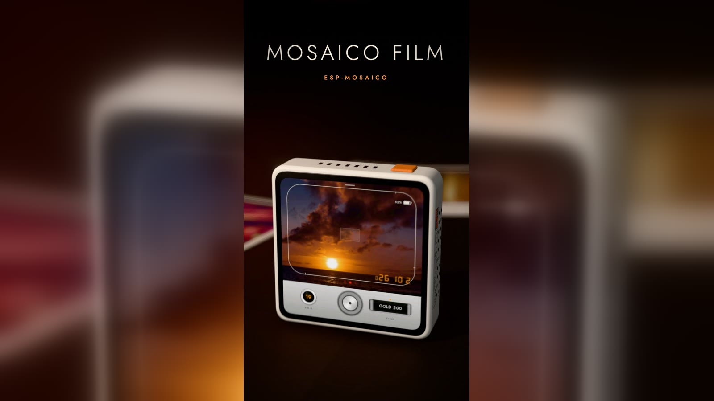
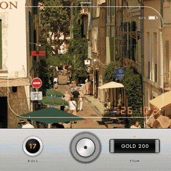
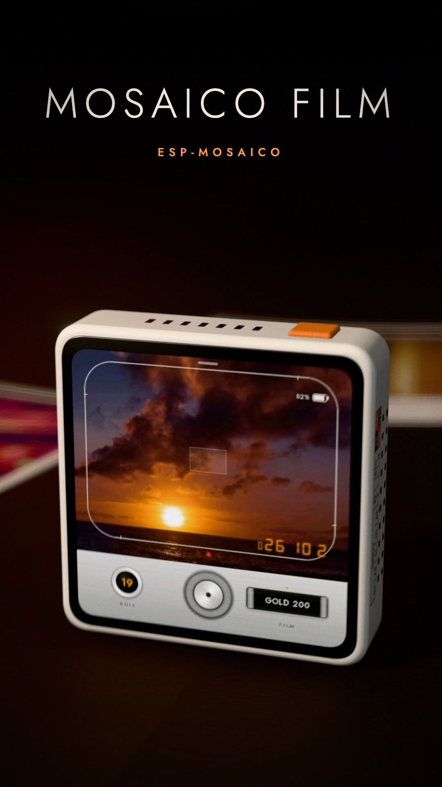
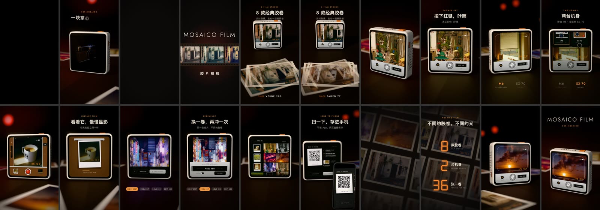

<div align="center">



# Mosaico Film

**A pocket film lab inside ESP-Mosaico**

Frame · Shoot · Develop · Reprocess · Share

[](https://mosaico-ideas.espressif.com/firmware/1cc4d85f-a6cf-4f7d-af48-17ca3bd18bd8)
[](https://hkgood.github.io/mosaico-film/)
[](https://github.com/hkgood/mosaico-film/releases/latest)

[](https://github.com/hkgood/mosaico-film/releases/latest)
[](LICENSE)


[中文](README.md) · **English**

</div>

---

<table>
<tr>
<td width="54%"></td>
<td>

Mosaico Film turns ESP-Mosaico into a digital film camera with a viewfinder, shutter, film rolls and a darkroom.

Pick a body inspired by a classic rangefinder or folding instant camera, turn the dial to load a film, set exposure and press the red hardware key. Every photo is developed and stored locally, and the original can be reprocessed with another film later.

| | |
| :-: | :-: |
| **8** film stocks | **2** camera experiences |
| **480×480** custom UI | **On-device** lab and album |

</td>
</tr>
</table>

## 🎬 Demo film

> Select the poster to watch the complete film on the [project site](https://hkgood.github.io/mosaico-film/#film).

<p align="center">
  <a href="https://hkgood.github.io/mosaico-film/#film">
    
  </a>
</p>

## 📷 From viewfinder to darkroom

<p align="center"></p>

1. **Choose a body** — pull down from the top to switch between the M6-style rangefinder and SX-70-style instant camera.
2. **Load a film** — turn the dial to select a stock, or shake the device for a random roll.
3. **Shoot** — use the on-screen shutter or the red AI hardware key, with exposure compensation, light leaks and date stamp controls.
4. **Develop locally** — crop, rotate, grade, add grain and vignette, compose the print and save it to onboard storage.
5. **Reprocess** — keep the source frame and create another interpretation with a different film.
6. **Send to phone** — select photos and scan a QR code to download through the same Wi-Fi network or the camera's temporary hotspot.

## 🎞️ Eight film stocks

| Film | Character |
| --- | --- |
| **GOLD 200** | Warm color, rich daylight and soft grain |
| **SOFT 400** | Lower contrast, natural skin tones and warm shadows |
| **VERDE 200** | Green-blue shadows and clear highlights |
| **CROSS X** | Cross-processed contrast, blue shadows and warm highlights |
| **SILVER 400** | Silver-gelatin monochrome, pronounced grain and vignette |
| **FADED 77** | Faded warmth and lifted blacks |
| **NIGHT 800T** | Tungsten nights, cool color and red halation |
| **PIXEL 8BIT** | Downsampling and palette quantization |

The viewfinder uses a fast preview path; final photos use the complete development pipeline. Grain and light leaks are deterministic when the same seed is used.

## 🧪 One device, two cameras

- **M6-style rangefinder** — 4:3 framing, film counter, exposure dial and date stamp for continuous shooting.
- **SX-70-style instant camera** — square framing, instant-print layout and tactile lever feedback.
- **Sound and haptics** — individual cues for shutter, dial detents, controls and shake-to-load.
- **Orientation aware** — capture orientation is recorded and the developed photo is automatically rotated upright.

> M6, SX-70, Leica and Polaroid are trademarks of their respective owners. This independent project is not affiliated with or endorsed by those companies.

## ⚡ Install

**Hardware**

- ESP-Mosaico board (ESP32-S31, 16 MB flash)
- OV3640 camera module in the left expansion slot

**Web installer (recommended)**

1. Open the [official Mosaico Film page](https://mosaico-ideas.espressif.com/firmware/1cc4d85f-a6cf-4f7d-af48-17ca3bd18bd8) on Mosaico Ideas.
2. Connect the device over USB, choose **Online flashing** in the firmware download panel and follow the on-page steps.
3. The page also offers the Iris package and a full BIN. The full BIN is meant for first installation and overwrites the firmware and settings on the device.

**Install from GitHub Releases**

1. Download the `.irisfw` bundle from the [v1.0.0 release](https://github.com/hkgood/mosaico-film/releases/latest).
2. In an ESP-Mosaico workspace, run `python mosaico.py iris system-update --bundle <package.irisfw>`.
3. Run `python mosaico.py recover` first for a blank or unverified device.

Mosaico Film uses its own `assets` partition and application layout, so the first installation must be a full `system-update`. The retained Vibe Mode firmware and its settings remain intact.

## 🧩 Engineering highlights

- **Portable C UI** — every screen is drawn into a 480×480 RGB565 canvas; `film_port_t` connects the same UI to PC and device services.
- **On-device darkroom** — curves, saturation, split toning, halation, vignette, light leaks and grain run locally; pixel film has a dedicated quantization path.
- **Asynchronous capture path** — preview, full-resolution processing, JPEG encoding and NAND writes are separated while progress events keep the UI responsive.
- **App-free sharing** — a session-scoped gallery is served over LAN or a temporary hotspot; scan and download in a phone browser.
- **Host-testable core** — film filters, the darkroom, library and complete UI interactions compile and run on a desktop.

## 🛠️ Build from source

This repository is an ESP-Mosaico application. Clone it into
`projects/mosaico_film` in an
[`esp-mosaico-vibe`](https://github.com/esp-mosaico/esp-mosaico-vibe)
workspace:

```sh
git clone https://github.com/esp-mosaico/esp-mosaico-vibe.git
cd esp-mosaico-vibe
git submodule update --init \
  submodule/esp-mosaico-utils \
  submodule/esp-mosaico-bsp
git clone https://github.com/hkgood/mosaico-film.git projects/mosaico_film

python mosaico.py project sim --project projects/mosaico_film --interactive
python mosaico.py iris system-update --project projects/mosaico_film
```

Firmware targets `esp32s31` and requires the ESP-IDF revision pinned by the workspace. See [DEVELOPMENT.md](DEVELOPMENT.md) for host tests, the module map, media generation and safe device-update guidance.

```text
main/          Device services: camera, lab task, storage, sharing and feedback
components/    Portable UI, filters, darkroom, graphics, assets and QR encoder
pc/            PC simulator platform implementation
host_test/     Filter, darkroom, library and interaction tests
ui/            ESP-GSP scene and fonts
promo/         Remotion demo film project
docs/          GitHub Pages and selected media
```

## 📄 License and credits

[Apache License 2.0](LICENSE) © 2026 Rocky. See [THIRD_PARTY_NOTICES.md](THIRD_PARTY_NOTICES.md) for third-party libraries, fonts, photographs and trademark notices.
